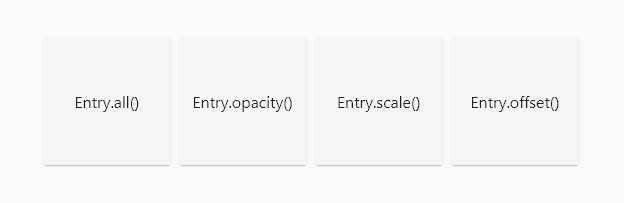

# Entry

The `Entry` widget lets you simply animate a widget into a visible state.

- Don't just display widgets : make them **appear**.
- Lightweight and flexible : **one** widget is all you need.
- Wrap a widget with an `Entry` widget, and watch the **magic** happen.

## 🏭 Constructors

### Default

The default constructor animates **opacity**, **scale** and **position** concurrently.

You can specify the `delay`, `duration` and the animation `curve`.

Every animation parameter is exposed but optional.

### Named

`Entry` has three named constructors (with corresponding parameters) :

- `Entry.alpha()` animates **opacity** only
- `Entry.scale()` animates **scale** only
- `Entry.offset()` animates **position** only

## 👷 Working with builders

Using `Entry` with **list** and **grid** builders can create a staggered effect :

- Wrap the generated child with an `Entry` widget
- Multiply your `delay` value by the `index`

# ✊ Motivation

- Animations are key to elevate and refine the user experience.
- By default, all widgets appear instantly. It feels basic, almost webpage-like.
- Flutter doesn't provide a simple way to delay and animate a widget's entry into view.
- Animations overall implies a lot of complexity and extra boilerplate code.
- I got tired of copying the same file over multiple projects.

# 🙏 Credit

A special thank you to Felix Blaschke for his [simple_animations](https://pub.dev/packages/simple_animations) package. This package literally depends on it.
